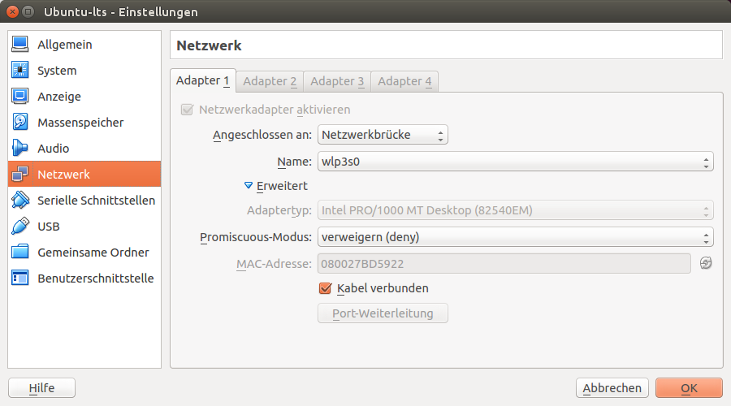

# virtualbox-setup
How to setup virtualbox on a current ubuntu machine running an ubuntu lts server

## Install virtualbox
- Use "Ubuntu 14.04" as name for the vm
- Select OpenSSH server only once asked
- OPen the virtualbox gui and change the existing network interface of your guest system from **NAT** to **Bridge** (in German: 'Netzwerkbrücke'):
 


- Boot the guest system
- Check the configuration network intefaces:
```bash
ifconfig
eth0      Link encap:Ethernet  HWaddr 08:00:27:bd:59:22  
          inet addr:192.168.2.113  Bcast:192.168.2.255  Mask:255.255.255.0
          inet6 addr: fe80::a00:27ff:febd:5922/64 Scope:Link
          inet6 addr: 2003:66:8745:2801:a00:27ff:febd:5922/64 Scope:Global
          UP BROADCAST RUNNING MULTICAST  MTU:1500  Metric:1
          RX packets:83 errors:0 dropped:0 overruns:0 frame:0
          TX packets:70 errors:0 dropped:0 overruns:0 carrier:0
          collisions:0 txqueuelen:1000 
          RX bytes:11496 (11.4 KB)  TX bytes:10520 (10.5 KB)

lo        Link encap:Local Loopback  
          inet addr:127.0.0.1  Mask:255.0.0.0
          inet6 addr: ::1/128 Scope:Host
          UP LOOPBACK RUNNING  MTU:65536  Metric:1
          RX packets:0 errors:0 dropped:0 overruns:0 frame:0
          TX packets:0 errors:0 dropped:0 overruns:0 carrier:0
          collisions:0 txqueuelen:0 
          RX bytes:0 (0.0 B)  TX bytes:0 (0.0 B)
```
- in this example 192.168.2.113 is the guests's ip address
- Now the guest is accessible using ssh:
```bash
ssh username@192.168.2.113
username@192.168.2.113's password: 
Welcome to Ubuntu 14.04.3 LTS (GNU/Linux 3.19.0-42-generic x86_64)

 * Documentation:  https://help.ubuntu.com/

  System information as of Tue Dec 22 09:31:45 CET 2015

  System load:  0.26               Processes:           84
  Usage of /:   11.4% of 13.40GB   Users logged in:     1
  Memory usage: 2%                 IP address for eth0: 192.168.2.113
  Swap usage:   0%

  Graph this data and manage this system at:
    https://landscape.canonical.com/

Last login: Tue Dec 22 09:31:45 2015 from jukey-thinkpad-x240
```
- You need to change the configuration if the network of the host changes.
